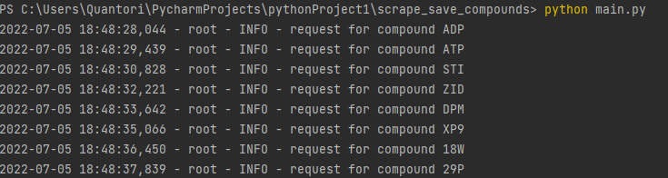
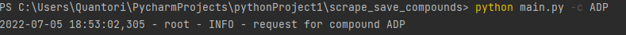
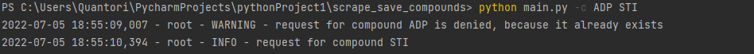
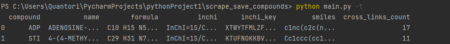
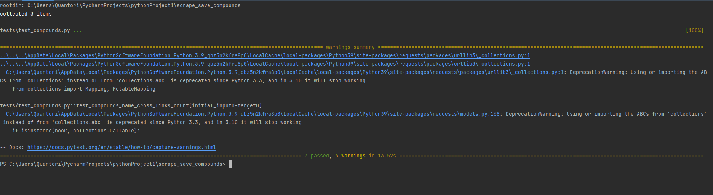

# Scrape_save_compounds  
  
## Getting Started  
  
This is an example of how you may give instructions on setting up your project locally. To get a local copy up and running follow these simple example steps.  
  
## Prerequisites  
  
In this block we install all the necessary tools for project to run correctly on the IDE.

**IT IS MANDATORY THAT YOU HAVE INSTALLED , IF YOU HAVE NOT PLEASE FOLLOW THE INSTRUCTIONS [HERE](https://www.docker.com/) AND INSTALL IT**
```  
conda create --name <env_name>  
conda activate <env_name>  
pip install -r requirements.txt  
  
# run docker  
docker-compose up -d  
```  
  
## Run program  


### Examples of correct run: 

```  
python main.py  
```  

Running project and adding all compounds to the database if they are not in it

```  
python main.py -c ADP 
```   

Adding ADP compound to the database
```  
python main.py -c ADP STI  
```  

Adding STI compound to database and giving warning on ADP, because it is already in database


## Showing table  
```  
python main.py -t  
```  

Showing data of the current database
  
## Run tests  

**MAKE SURE YOU EMPTY DOCKER BEFORE YOU RUN TESTS ON THIS, BECAUSE EXISTING DATA MIGHT MESS THE TESTING LOGIC**

### RUN FOLLOWING COMMANDS:


```  
docker-compose down 
docker-compose down --volumes
```  

After this you are free to test the environment by command:
  

```  
python -m pytest  
```  



# License  
[MIT](https://choosealicense.com/licenses/mit/)